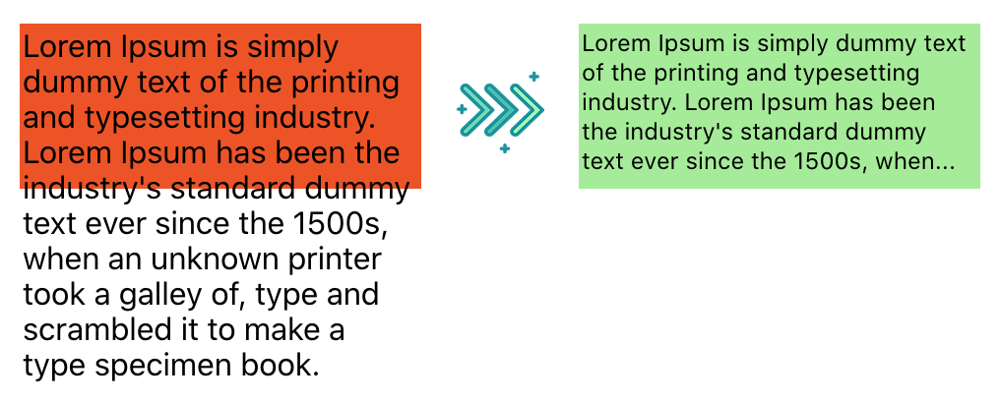

# [react-controlled-text](https://github.com/GR34SE/react-controlled-text) &middot; [](https://www.npmjs.com/package/react-controlled-text) [](https://github.com/GR34SE/react-controlled-text) [](https://github.com/prettier/prettier)

Multiline text clamp and scale to fit component for React ⚛️

### Available features
- Resize text to fit within a container
- Multiline text clamp

Both features are enabled by default (see props below).

### Example


### Usage

```jsx
import ControlledText from "react-controlled-text";
```

```jsx
<div style={{backgroundColor: "lightgreen", width: 200, height: 80, padding: 2}}>
    <ControlledText fontSizeMin={12} fontSizeMax={15} clampSuffix={"..."}>
        Lorem Ipsum is simply dummy text of the printing and typesetting industry. Lorem Ipsum
        has been the industry's standard dummy text ever since the 1500s, when an unknown
        printer took a galley of, type and scrambled it to make a type specimen book.
    </ControlledText>
</div>
```

### Props
| Prop  name                 | Type                    | Default                 | Required  | Note                                                                         |
| -------------------------  | ----------------------- | ----------------------- | --------- | ---------------------------------------------------------------------------- |
| fontSizeMin                | number                  | 10                      | no        | Minimum font size                                                            |
| fontSizeMax                | number                  | 16                      | no        | Maximum font size                                                            |
| className                  | string                  | "react-controlled-text" | no        | className that output tag will receive                                       |
| tagName                    | TagName (string)        | "span"                  | no        | One of: span, div, p, a, h1, h2, h3, h4, h5, h6                              |
| resizeThrottle             | number                  | 250                     | no        | Number of milliseconds to throttle window resize callback                    |
| clampSuffix                | string                  | "..."                   | no        | String to add at the end of clamped text                                     |
| disableScaling             | boolean                 | false                   | no        | Prop to disable auto-scaling                                                 |
| disableTextClamp           | boolean                 | false                   | no        | Prop to disable auto-text-clamping if needed                                 |

You can also pass other common HTML props such as onClick directly to the ControlledText component.